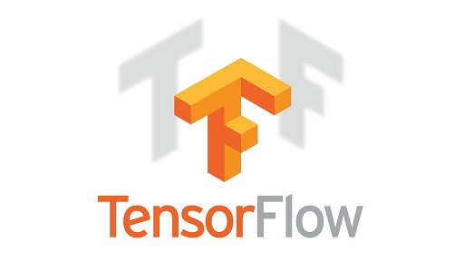

# Tensorflow-Tutorial

* Tensorflow basic: 
  * [Session](11_session.py)
  * [Placeholder](12_placeholder.py)
  * [Variable](13_variable.py)
  * [Activation](14_activation.py)
  
* Build your first network:
  * [Regression](21_regression.py)
  * [Classification](22_classification.py)
  * [Save and reload processes](23_save_reload.py)
  * [Optimizer](24_optimizer.py)
  * [TensorBoard](25_tensorboard.py)
  * [Dataset](26_dataset.py)
